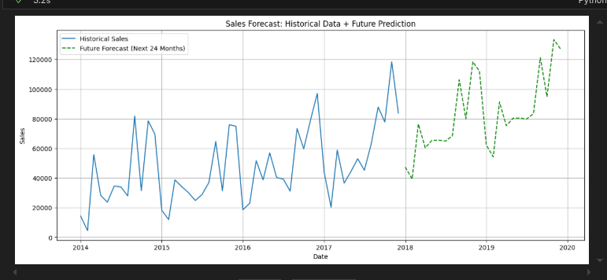
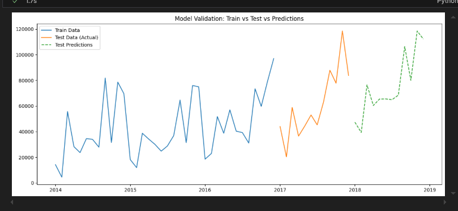

# Sales Forecasting Project

## Overview

This project implements a sales forecasting model using historical data from `Sample_Superstore.csv`. It aims to predict future sales trends to assist in business planning, inventory management, and budgeting. The core analysis and modeling are contained within the Jupyter Notebook `sales_forecasting.ipynb`.

## Key Features

- **Data Preprocessing**: Aggregates daily sales data into monthly totals for stable time-series analysis.



- **Forecasting Model**: Utilizes **Holt-Winters Exponential Smoothing** to capture both trend and seasonality in the sales data.



- **Visualization**: Provides clear plots of historical sales, model validation (test predictions), and future forecasts.
- **Business Insights**: Includes interpretations of the forecasts and actionable business recommendations.

## Files

- `sales_forecasting.ipynb`: The main Jupyter Notebook containing the code for data loading, analysis, modeling, and visualization.
- `Sample_Superstore.csv`: The dataset used for training and testing the model.
- `README.md`: This file, providing an overview of the project.

## Prerequisites

To run the notebook, you need Python installed along with the following libraries:

- `pandas`
- `numpy`
- `matplotlib`
- `seaborn`
- `statsmodels`
- `scikit-learn`
- `jupyter` or `jupyterlab`

## Installation

You can install the required dependencies using pip:

```bash
pip install pandas numpy matplotlib seaborn statsmodels scikit-learn jupyter
```

## Usage

1.  Ensure `Sample_Superstore.csv` is in the same directory as the notebook.
2.  Open the notebook:
    ```bash
    jupyter notebook sales_forecasting.ipynb
    ```
3.  Run all cells to execute the analysis and generate the forecasts.

## Results

The notebook generates a 24-month sales forecast. The visualizations show the predicted sales trends, highlighting seasonal peaks and overall growth/decline patterns. These insights can be used for:

- **Inventory Planning**: Stocking up in anticipation of high-demand months.
- **Resource Allocation**: Adjusting staffing and marketing budgets based on predicted revenue.
